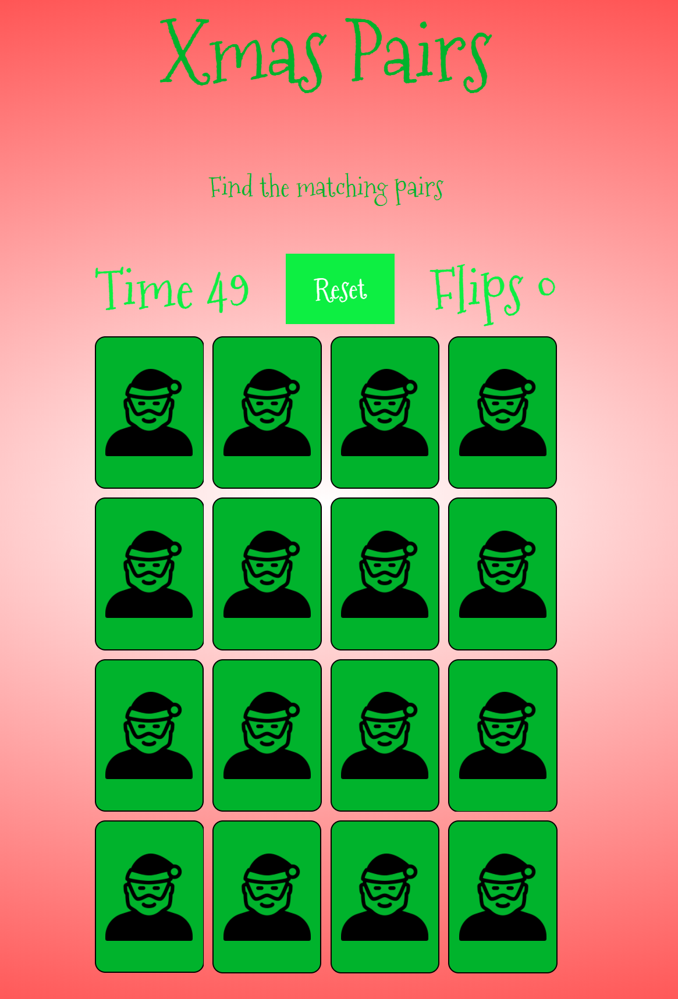

# XMAS PAIRS

This project is a simple yet challenging memory game with a user-friendly design. The goal of the project is to create a game
that is both fun and challenging for users of all ages. The game will shuffle the cards at the start of each game and have a time limit to beat.
[Demo of site](https://verga1.github.io/Xmas-Pairs/)

## UX

### **Goals:**
* To create simple matching pairs game accessible to anyone 

* To have a loss condition in order to encourage repeat engagement from players

### **User Stories**

> Gary: I like to play games as a time killer when commuting

> Amy: I play quick games while waiting on my bus to pass the time

All the users gave similar replies. For them a simple game like Xmas Pairs 
wasn't something they would commit a lot of time to but looked to play when they 
were trying to pass time. This informed the game design in that it made clear 
that the game needed to be easy to stop and started very easily and have a 
goal which could be achieved in a short space of time. 

* The overlay screen can be clicked to immediately start the game
* The timer starts to countdown from 60 Seconds upon activation
* The card is flipped to reveal a picture upon being clicked
* A second card is then flipped to see if picture matches
* If the picture matches the cards remain flipped and a sound of jingle bells play
* If the cards don't match they flip back over and can be chosen again
* Play continues until all macthes are made or the timer runs out

### **Strategy**

The aim was to create a very simple site that focused on the gameplay. A memory
game using Christmas themed cards to make it accessible to all ages.

### **Scope**

Originally there were going to be a choice in difficulty from easy, medium and hard. 
The aim was that this would appeal to a wider audience who could commit their time 
and energy to a difficulty that suited them at any moment. Due to time the harder
difficulties were ommited leaving the base game which is accessible to anyone.

### **Structure**

The site has three overlays and the main playing page. The initial overlay can be clicked in order for the game to begin.
This opens the game page. The page contains 16 cards with 8 matching pairs. A countdown timer and flip counter are also included.
There are two other End Game overlays if the player wins, or loses. Both can be clicked in order to restart the game.

### **Skeleton**

[Here](https://github.com/Verga1/Xmas-Pairs/tree/master/wireframes) are the designs I made for the site.

The wireframes were made using [Balsamiq](https://balsamiq.com/)

### **Surface**

- **Font**: I wanted to use a single font throughout the site, it needed to look "festive" to fit in with the Christmas theme, with this in mind I decided to use [Mountains of Christmas](https://fonts.google.com/specimen/Mountains+of+Christmas#glyphs) from [Google Fonts](https://fonts.google.com/).

- **Colours**: I used red, white and 2 different shades of green to keep a Christmas style throughout.

## FEATURES

 - Game Instructions: Tells users how to play the game.
 - Music: Xmas theme plays when you begin the game.
 - Game Timer: When the game starts a timer begins counting down from 60 when it hits zero the game is over.
 - Move Counter: Counts how many moves a user makes while playing.
 - Game Over Screen: When the timer hits zero the game over screen will appear allowing the users to try again.
 - Victory Screen: When the user has found all 8 matches before the time runs out the Victory screen will appear showing their score and allowing them to play again.
 - Defense Functions: 
 1. The game will not allow cards to be flipped if there is a card animation taking place.
 2. The game will not allow a card to be flipped if it is part of a matched pair.
 3. The game will allow the same card to be flipped back to hidden until a second card has been selected to check for a match.

 ### Features Left to Impliment

* Game could have different levels with more matches to be made.
* Game could use a scoring system based on how quick all matches were made.

 ## TECHNOLOGIES USED

- HTML:
This project uses HTML5 to provide the content and structure.
- CSS:
The project uses CSS3 for styling.
- Gitpod:
This project was developed using Gitpod as the IDE.
- GitHub:
The project uses GitHub to host the repository and for the live preview of the site
- Google Fonts:
The project uses Google fonts to style the website fonts.
- Javascript:
The project uses JavaScript for game functions.

 ## TESTING

 ### Manual Testing
Manual tests have been done throughout the development of the project.  
The following test scenarios confirms that the website is behaving accordingly, and that bugs have been taken care of:

### Navigation Testing

#### Overlays
1. Click on Start to Play overlay
2. Verified that this will start the game
3. When game ends click on You Win overlay or Game Over overlay
4. Verified that game restarts

#### Reset button
1. Click on Reset button
2. Verified that this refreshes page and shows Start Game overlay

## Game Play Testing
1. Click on Start to Play overlay
2. Verified that countdown clock has started
3. Click on card
4. Verified it flips and adds total to flip countdown
5. Click on second card
6. Verified a third card can't be flipped during this time
7. Verified if cards unmatched they flip back over
8. Find matches
9. Verfied that match audio plays, icons rotate and cards remain flipped
10. When all matches are made verfiy you win overlay pops up and audio plays
11. When timer runs out verify Game Over overlay pops up and audio plays

### Browser and Mobile Devices Testing
All the test scenarios have been carried out in the browsers and mobile devices as listed below. No problems were found regarding the responsiveness, overflow and the functionality except Safari.

#### Browser Testing
- Google Chrome 
- Mozilla Firefox 
- Microsoft Edge 
- Safari

#### Devices used

 - HP Envy
 - Lenovo ThinkPad
 - iPhone XS

#### Mobile Device Testing through Chrome DevTools
- Moto G4 
- Galaxy S5
- iPhone 5/SE/6/7/8/Plus
- iPad (Pro)

## Key Issues and Code Validation
### W3C Markup Validator
* Error was found using Markup Validator: Image elements were not using an alt attribute. This was corrected and Validator showed no errors after correction.

### W3C CSS Validator
* No errors or warnings were found

### Browser and mobile testing
- No issues were found on Google Chrome, Mozilla Firefox, Microsoft Edge
- Issue was found on using Safari on iPhone XS - cards were already flipped and game could not be played. This will be a pending issue and require the website to be altered in order to be compliant with Safari browser.

### Bugs

* The endGame overlays text were not centered on some smartphones but still worked when tapped. Due to time constraints this will be corrected at a later date.
* If matches are made in quick succession, the audio will only play for the first match made. Due to time constraints this will be corrected at a later date.

 ## DEPLOYMENT

This project was developed using the Gitpod IDE, committed to git and pushed to GitHub using the built in function within Gitpod.

To deploy this page to GitHub Pages from its GitHub repository, the following steps were taken:

1. Log into GitHub.
2. In the list of repositories on the screen, select XMAS Pairs.
3. In the menu items near the top of the page, select Settings.
4. Scroll down to the GitHub Pages section.
5. Under Source select the drop-down menu labelled None and select Master Branch and hit save
6. The Master Branch automatically refreshes the page, the website has now been deployed.
7. Scroll down to the GitHub Pages section in order to retrieve the link to the deployed website.

### Run the project locally

Clone this project from GitHub:

1. Click for the [GitHub repository].
2. Near the top of the page, click the green button "Clone or download".
3. In the Clone with HTTPs section, copy the clone URL for the repository.
4. Open your preferred IDE.
5. Change the current working directory to the location where you want the cloned directory to be made.
6. Type git clone, and then paste the URL you copied in Step 3.
7. Press Enter. Your local clone will be created.

Further details on cloning a repository can be found on [GitHub](https://help.github.com/en/github/creating-cloning-and-archiving-repositories/cloning-a-repository).

## CREDITS

### Content

 - I achieved the base game functionality by following this tutorial by [PortEXE](https://youtu.be/3uuQ3g92oPQ).
 - The game uses the [Fisher-Yates shuffle](https://en.wikipedia.org/wiki/Fisher%E2%80%93Yates_shuffle) to shuffle the cards.

 ### Media

 - The background music was made by [Ashamaluevmusic](https://soundcloud.com/ashamaluevmusic).
 - Sound effects were made by [Soundbible](https//:www.soundbible.com) and [Shockwave-sound](https://www.shockwave-sound.com/).
 - The card icons were made by [Pixelperfect](https://www.flaticon.com/authors/pixel-perfect).

## Acknowledgements
 - I received inspiration for this project from [WebDevSimplified](https://www.youtube.com/channel/UCFbNIlppjAuEX4znoulh0Cw) and [PortEXE](https://portexe.com/) on their [Mix-Or-Match](https://youtu.be/3uuQ3g92oPQ) project.
